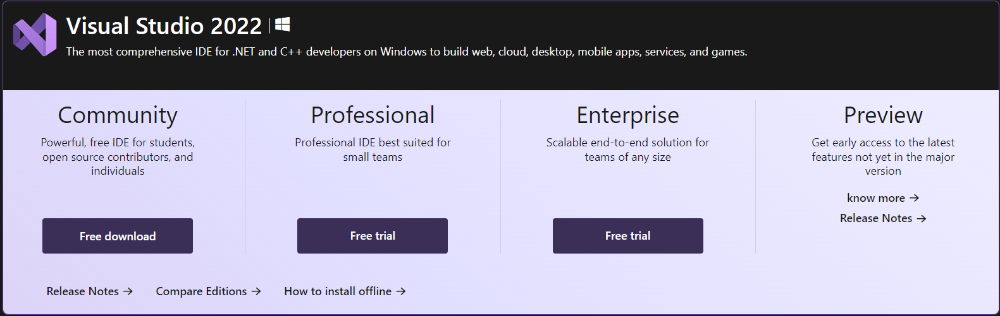
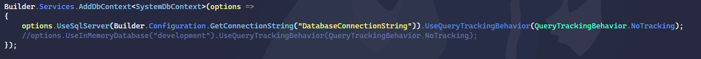
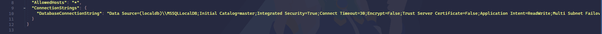
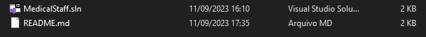
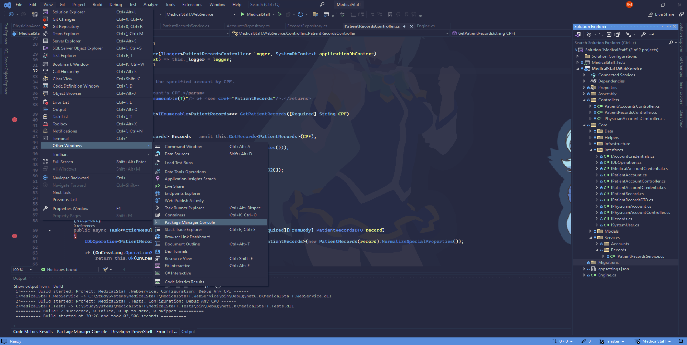
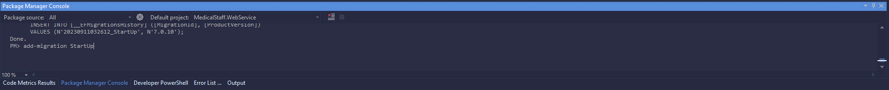
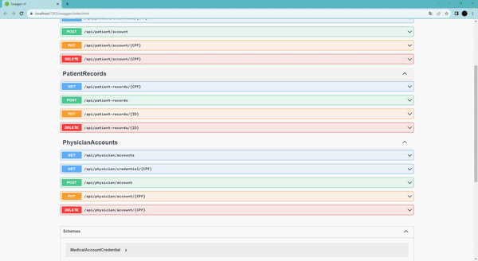

# Pretty and Simple ASP.NET Core REST API with Entity Framework Core

## Context

The goal is to develop an API that allows doctors to create, edit
and delete records, while patients will be able to view their own information. The
project aims to offer security, efficiency and ease of access to clinical data,
ensuring patient privacy and facilitating collaboration between doctors and others
Health professionals. The medical staff as well as the patients will be able to create their own user accounts.

# Setup

##### - How to install Visual Studio 2022

<h6></h6>

Microsoft Visual Studio is an integrated development environment (IDE) from Microsoft. It is used to develop computer programs for Microsoft Windows. Visual Studio is one stop shop for all applications built on the .Net platform. One can develop, debug and run applications using Visual Studio.
Both Forms-based and web-based applications can be designed and developed using this IDE. [See more.](https://visualstudio.microsoft.com/pt-br/downloads/)

- [Download Visual Studio 2022 Community](https://visualstudio.microsoft.com/pt-br/thank-you-downloading-visual-studio/?sku=Community&channel=Release&version=VS2022&source=VSLandingPage&cid=2030&workload=dotnet-dotnetwebcloud&passive=false#dotnet)
- [Installation Guide](https://learn.microsoft.com/en-us/visualstudio/install/install-visual-studio?view=vs-2022) - By installing, choose the ASP.NET and Web Applications workload container and follow along with the installation guide.

# Database

#### Download & Install the Microsoft SQL Server Management Studio

- [Download SQL Server Management Studio](https://learn.microsoft.com/en-us/sql/ssms/download-sql-server-management-studio-ssms?view=sql-server-ver16#download-ssms) and follow [this Guide](https://www.nobledesktop.com/how-to-install-sql-server-management-studio)

### Executing the API

- #### [Donwload](https://github.com/Linguist-Codifier/MedicalStaff/archive/refs/heads/master.zip) the Solution or clone it as follows
```bash
  #Clone this repository
  $ git clone https://github.com/Linguist-Codifier/MedicalStaff.git
```

## Configurations

### Choosing whether executing the API with 'Runtime memory as its Database' or with SQL Server

- For 'In memory' database, uncomment this line, and comment the one above at Engine.cs file:
<h6></h6>

- For SQL Server database, [get your local SQL Server connection string](https://www.c-sharpcorner.com/article/get-connectionstring-for-sql-server/) and replace the one already set in the appsettings.config file:
<h6></h6>

- #### Open the Solution

<h6></h6> 

##### Make sure you open it up with Visual Studio 2022 in case there are any other versions already installed.

- After openning the Solution, Visual Studio will check any missing dependency and will try to download them from NuGet.

- Compile the solution by pressing CTRL + SHIFT + B.

- Then, open up the NuGet Package Manager and write 'add-migration StartUp'. Make sure your Connection String is already set up as previously mentioned.

- Then finally, write update-databse on the same console.

<h6><</h6>

<h6></h6>

<h6></h6>

- After everything is set up, build the solution by pressing CTRL + SHIFT + B and run it as follows:

<h6></h6>

There are two main modes of execution, one is in Debugging mode and the other is without debugging at runtime. It can also be done by either pressing CTRL + F5 (For runtime debugging) or F5 (No debugging).

# Executing

<h6></h6>

[Download demonstration](https://github.com/Linguist-Codifier/MedicalStaff/archive/refs/heads/master.zip)
